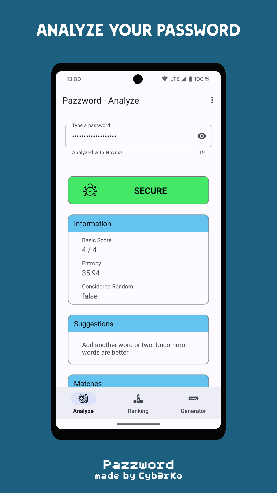
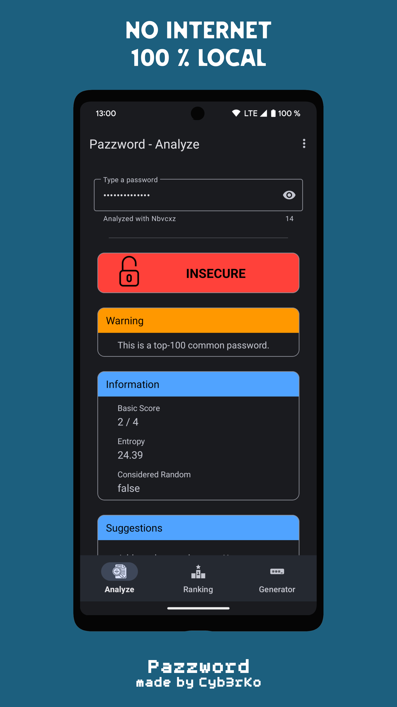
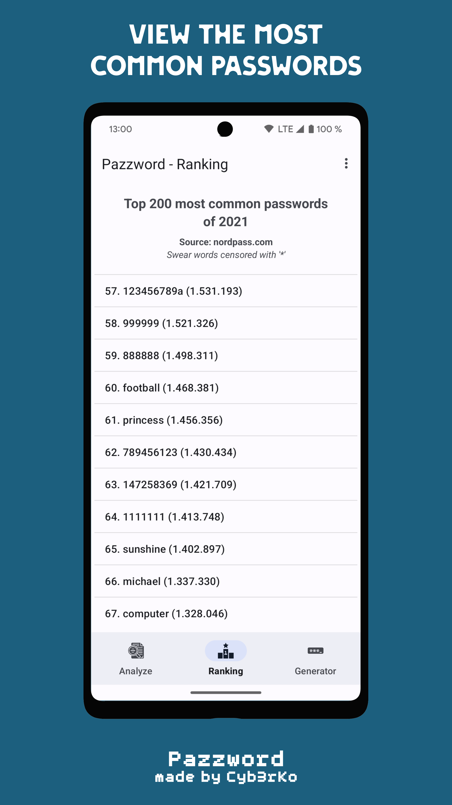
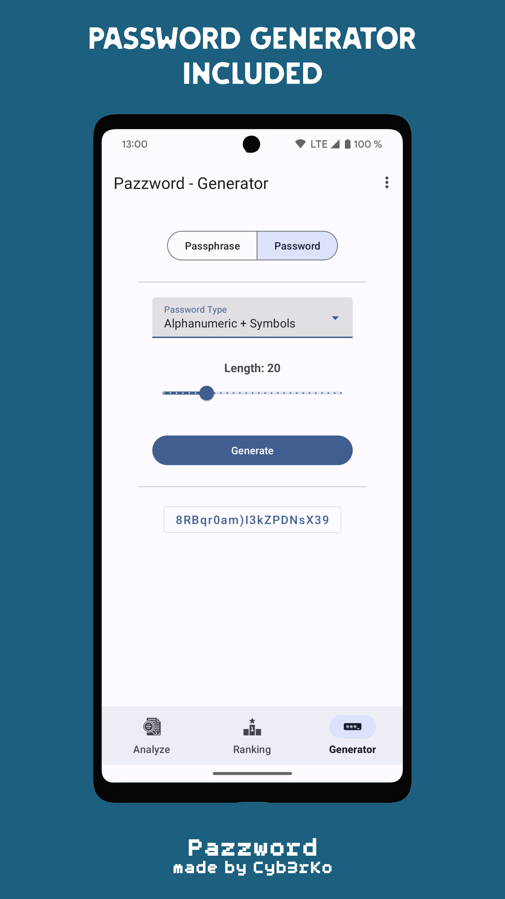

# Pazzword

- [About this project](#about-this-project)  
    <!-- - [Translation](#translation) -->
- [Features](#features)  
- [Download](#download)
- [Screenshots](#screenshots)   
- [Contribute](#contribute)  
- [License](#license)  

---

## About this project
Welcome to the most intelligent password evaluator app 'Pazzword'.

It analyzes passwords using the open source library '[nbvcxz](https://github.com/GoSimpleLLC/nbvcxz)', a Java adaptation of '[zxcvbn](https://github.com/dropbox/zxcvbn)' by Dropbox.

In comparison to other password evaluator tools this secure and flexible tool uses algorithms for pattern matching and conservative estimation to give you the best results currently possible. It recognizes and weighs 30.000 common passwords, common names & surnames, most english words and common patterns like dates, repeats, sequences, keyboard patterns and l33t speak.
For more information visit https://github.com/dropbox/zxcvbn.

You are welcomed to open new [issues](https://github.com/cyb3rko/pazzword/issues) and creating [pull requests](https://github.com/cyb3rko/pazzword/pulls) for improving code and implementing new features (see chapter [Contribute](#contribute)).  
Furthermore I'm still a student so the progress might not be as fast as on other projects.

<!-- ### Translation

[TRANSLATION PROJECT](https://poeditor.com/join/project?hash=ygnGPjgRfN)

You can now translate this app in many different languages.  
If you can't find a language you're looking for, just drop me a mail at niko@cyb3rko.de and I will add it. -->

## Features
Analyzing entered passwords with the following feedback:
- a score,
- entropy,
- custom suggestions,
- found patterns and
- estimated stability against cracking
for the returned password.

Accessing the 200 most common passwords of 2021 ([source](https://nordpass.com/most-common-passwords-list/)).

## Download

F-Droid download link available soon

## Screenshots

|||||
|:---:|:---:|:---:|:---:|

## Contribute
Of course I'm happy about any kind of contribution.

For creating [issues](https://github.com/cyb3rko/pazzword/issues) there's no real guideline you should follow.
If you create [pull requests](https://github.com/cyb3rko/pazzword/pulls) please try to use my syntax that I follow.
Using a unified code format makes it much easier for me and for everyone else.

## License

    Copyright 2023, Cyb3rKo

    Licensed under the Apache License, Version 2.0 (the "License");
    you may not use this file except in compliance with the License.
    You may obtain a copy of the License at
    
        http://www.apache.org/licenses/LICENSE-2.0

    Unless required by applicable law or agreed to in writing, software
    distributed under the License is distributed on an "AS IS" BASIS,
    WITHOUT WARRANTIES OR CONDITIONS OF ANY KIND, either express or implied.
    See the License for the specific language governing permissions and
    limitations under the License.
